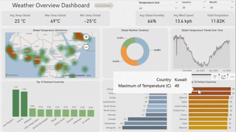
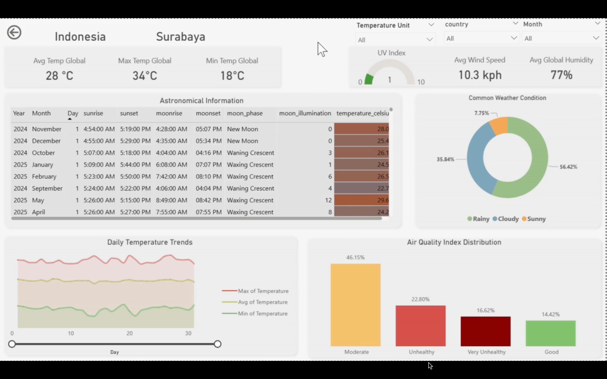

# Global Weather Overview Dashboard

> 📊 **View interactive dashboard demo here:** [Click Here](https://drive.google.com/file/d/1wAYhASo5g8RRpCqWGA8V3gGpB3qy1Uo_/view?usp=sharing)

---
##  Introduction

This Power BI dashboard helps anyone interested in weather understand it better. It solves the problem of scattered and complex weather data by offering one easy-to-use interface. Using real weather observations, this project lets you explore global trends, specific local conditions, and even celestial details.

---

##  Dashboard File

Get the Power BI project file here: **[Global Waether Dashboard](<GlobalWatherDashboard.pbix>)** 

---

## Skills & Features

This project showcases my proficiency in:

* **Data Transformation (Power Query):** Cleaning and preparing raw data, managing types, and sorting for accuracy.
* **DAX Measures:** Creating key metrics like **Avg/Max/Min Temperatures, Humidity, Wind Speed, Total Precipitation**, and **Fahrenheit conversions**.
* **Diverse Visuals:** Using **Pie, Line, Bar, and Map Charts** for trends, distributions, and comparisons.
* **Geospatial Analysis:** Leveraging **Map Charts with Heat Maps** to visualize temperature spread.
* **KPIs & Tables:** Displaying key metrics with **Cards** and detailed data with a **Table visual** (for celestial details).
* **Clean Design:** Focused on an **intuitive, visually engaging, and harmonious layout**.
* **Dynamic Interactivity:**
    * **Slicers:** Filtering by **Month, Country**, and a **Temperature Unit Selector (Celsius/Fahrenheit)**.
    * **Conditional Formatting:** Applying dynamic cell background colors to temperature in tables.
    * **Drill-Through:** Seamlessly navigating from global overview to local details.

---

## Dashboard Layout

*This report is split into two distinct pages to provide both a high-level summary and a detailed analysis.*

### **1. World Overview**

This is your mission control for understanding global weather patterns. It showcases key global metrics like average, max, and min temperatures, overall humidity, and total precipitation to give you a quick grasp of planetary climate at a glance. You can also explore geographical heat maps, global temperature trends over time, and common weather conditions worldwide.

### **2. Location Details**

This is the deep-dive page for specific locations. From the "World Overview," you can drill through to this view to get granular details for a selected city. Here, you'll find localized KPIs (including UV Index), common local weather conditions, air quality breakdowns, and fascinating celestial body details with daily temperature trends.

----

##  Conclusion

This dashboard offers a comprehensive look at global weather. Built using Power BI, it truly transforms complex environmental data into clear, actionable insights. This interactive platform gives anyone a powerful way to explore climate patterns, spot key trends, and gain a deeper understanding of our ever-changing environment.

---

#  لوحة تحكم نظرة عامة على الطقس

> 📊 **شاهد العرض التفاعلي للوحة التحكم هنا:** [اضغط هنا](https://drive.google.com/file/d/1wAYhASo5g8RRpCqWGA8V3gGpB3qy1Uo_/view?usp=sharing)

---

##  مقدمة المشروع

تساعد لوحة تحكم Power BI هذه أي شخص مهتم بالطقس على فهمه بشكل أفضل. إنها تحل مشكلة بيانات الطقس المتناثرة والمعقدة من خلال توفير 
واجهة واحدة سهلة الاستخدام. 

باستخدام ملاحظات الطقس الحقيقية، يتيح لك هذا المشروع استكشاف الاتجاهات العالمية، والظروف المحلية المحددة، وحتى التفاصيل الفلكية.

---

##  ملف لوحة المعلومات

يمكنك العثور على ملف Power BI الخاص بلوحة المعلومات هنا: **[لوحة تحكم الطقس العالمية](GlobalWeatherDashboard.pbix)**

---

##  المهارات والميزات

يعرض هذا المشروع كفاءتي في:

* **تحويل البيانات (Power Query):** تنظيف وإعداد البيانات الخام، إدارة أنواع البيانات، والفرز الدقيق.
* **مقاييس DAX:** إنشاء مقاييس رئيسية مثل **متوسط/أقصى/أدنى درجات الحرارة، الرطوبة، سرعة الرياح، إجمالي هطول الأمطار**، و**تحويلات فهرنهايت**.
* **مرئيات متنوعة:** استخدام **المخططات الدائرية، الخطية، الشريطية، والخرائط** لتصور الاتجاهات، التوزيعات، والمقارنات.
* **التحليل الجغرافي المكاني:** الاستفادة من **مخططات الخرائط مع خرائط الحرارة** لتصور انتشار درجات الحرارة.
* **مؤشرات الأداء الرئيسية (KPIs) والجداول:** عرض المقاييس الرئيسية باستخدام **البطاقات** والبيانات التفصيلية باستخدام **الجدول** (لتفاصيل الأجرام السماوية).
* **تصميم نظيف:** التركيز على تصميم **بديهي، جذاب بصرياً، ومتناسق**.
* **🖱️ تفاعلية ديناميكية:**
    * **مقسمات البيانات (Slicers):** التصفية حسب **الشهر، الدولة**، و**محدد وحدة درجة الحرارة (مئوية/فهرنهايت)**.
    * **التنسيق الشرطي:** تطبيق ألوان خلفية ديناميكية للخلايا على درجات الحرارة في الجداول.
    * **التصفح التفصيلي (Drill-Through):** التنقل بسلاسة من النظرة العامة العالمية إلى التفاصيل المحلية.

---

##  نظرة عامة على لوحة المعلومات

*ينقسم هذا التقرير إلى صفحتين متميزتين لتوفير كل من ملخص عالي المستوى وتحليل مفصل.*

### **1. الصفحة 1: نظرة عامة عالمية**

هذه هي لوحة المعلومات الرئيسية لفهم أنماط الطقس العالمية. إنها تعرض المقاييس العالمية الرئيسية مثل متوسط، أقصى، وأدنى درجات الحرارة، والرطوبة الإجمالية، وإجمالي هطول الأمطار لمنحك فهماً سريعاً للمناخ الكوكبي بلمحة. يمكنك أيضاً استكشاف خرائط الحرارة الجغرافية، واتجاهات درجات الحرارة العالمية بمرور الوقت، وظروف الطقس الشائعة في جميع أنحاء العالم.

### **2. الصفحة 2: تفاصيل الموقع**

هذه هي صفحة التعمق للحصول على تفاصيل مواقع محددة. من صفحة "النظرة العامة العالمية"، يمكنك التعمق في هذا العرض للحصول على تفاصيل محددة لمدينة مختارة. 
ستجد هنا مؤشرات الأداء الرئيسية المحلية (بما في ذلك مؤشر الأشعة فوق البنفسجية)، وظروف الطقس المحلية الشائعة، وتحليلات جودة الهواء، وتفاصيل الأجرام السماوية الرائعة مع اتجاهات درجات الحرارة اليومية.

---

##  الخاتمة

تقدم لوحة المعلومات هذه نظرة شاملة للطقس العالمي. تم بناؤها باستخدام Power BI، وهي تُحوّل البيانات البيئية المعقدة حقاً إلى رؤى واضحة وقابلة للتطبيق. تمنح هذه المنصة التفاعلية أي شخص طريقة قوية لاستكشاف أنماط المناخ، وتحديد الاتجاهات الرئيسية، واكتساب فهم أعمق لبيئتنا المتغيرة باستمرار.
